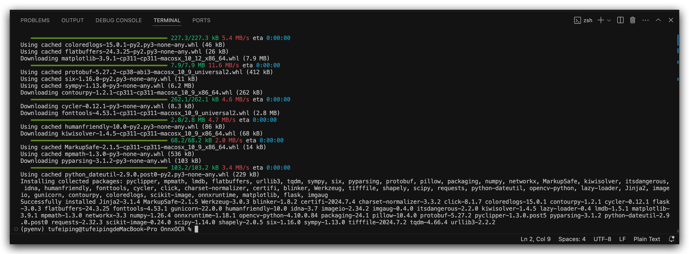

# OnnxOCR

## 版本更新
**PPOCRv4** 模型转 **onnx** 模型推理，精度和性能更高，推理速度比使用 `paddlepaddle`框架快 **5** 倍

## 一.优势：
1.脱离深度学习训练框架，可直接用于部署的通用 `OCR`。
2.在算力有限，精度不变的情况下使用 `paddleOCR` 转成 `ONNX` 模型，进行重新构建的一款可部署在 `arm` 架构和 `x86` 架构计算机上的 **OCR** 模型。
3.在同样性能的计算机上推理速度加速了**4-5** 倍。

##  二.部署:

### 创建虚拟环境
创建一个 `python` 虚拟环境

```shell
# create python env under the directory
python -m venv  ./pyenv

# activate the python env
source ./pyenv/bin/activate
```

>[!IMPORTANT]
> 要求 `python` 版本 >= `3.11`

### 安装依赖
原仓库的依赖不全，这里进行了必要的补充，增加了一些缺失的依赖，以便干净的 `python` 环境能正常运行起来

```
pip install -r requirements.txt
```



### 运行测试

直接运行 `test_ocr.py` 即可

```shell
python test_ocr.py
```

测试结果输出如下

```shell
python test_ocr.py 
total time: 0.356
result: [[[[[296.0, 299.0], [331.0, 298.0], [346.0, 849.0], [311.0, 850.0]], ('土地整治与土壤修复研究中心', 0.9767106175422668)], [[[346.0, 300.0], [378.0, 299.0], [386.0, 663.0], [354.0, 664.0]], ('华南农业大学—东图', 0.849502444267273)]]]
[[[296.0, 299.0], [331.0, 298.0], [346.0, 849.0], [311.0, 850.0]], ('土地整治与土壤修复研究中心', 0.9767106175422668)]
[[[346.0, 300.0], [378.0, 299.0], [386.0, 663.0], [354.0, 664.0]], ('华南农业大学—东图', 0.849502444267273)]
```